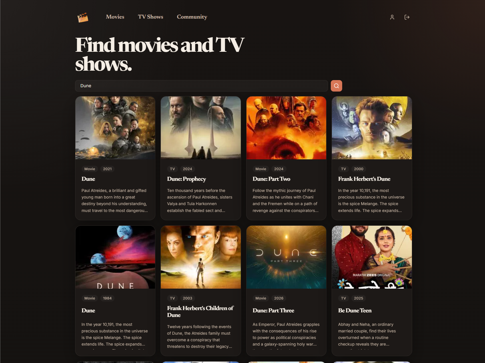
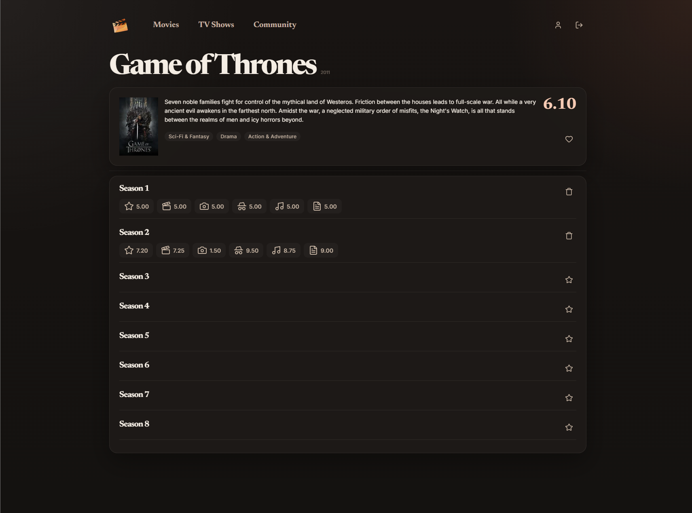
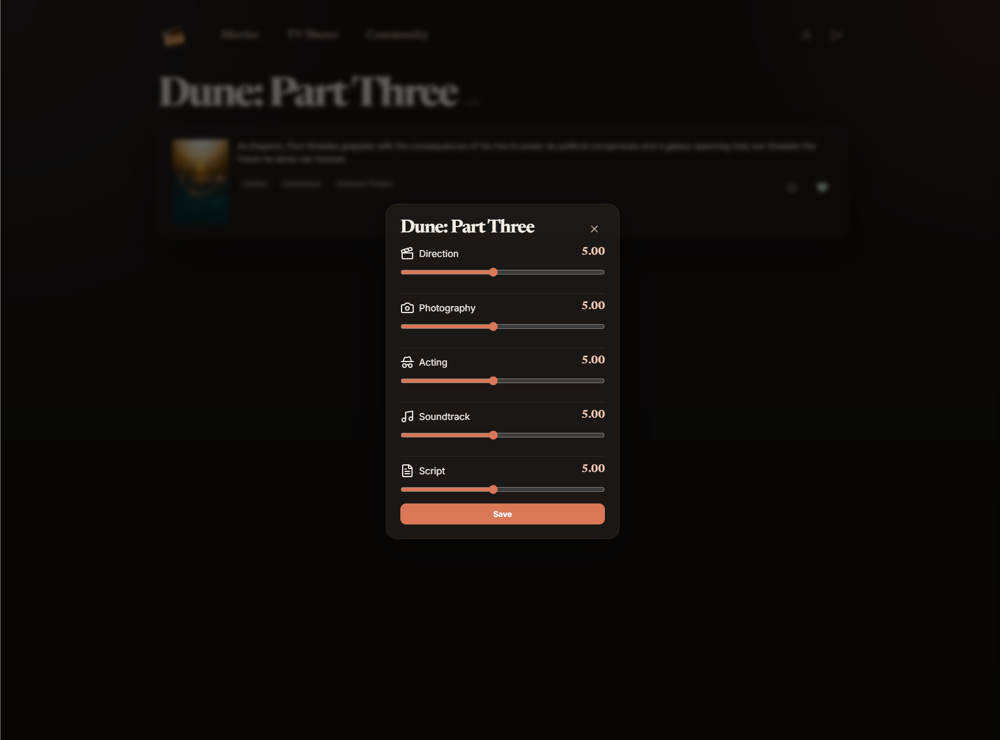
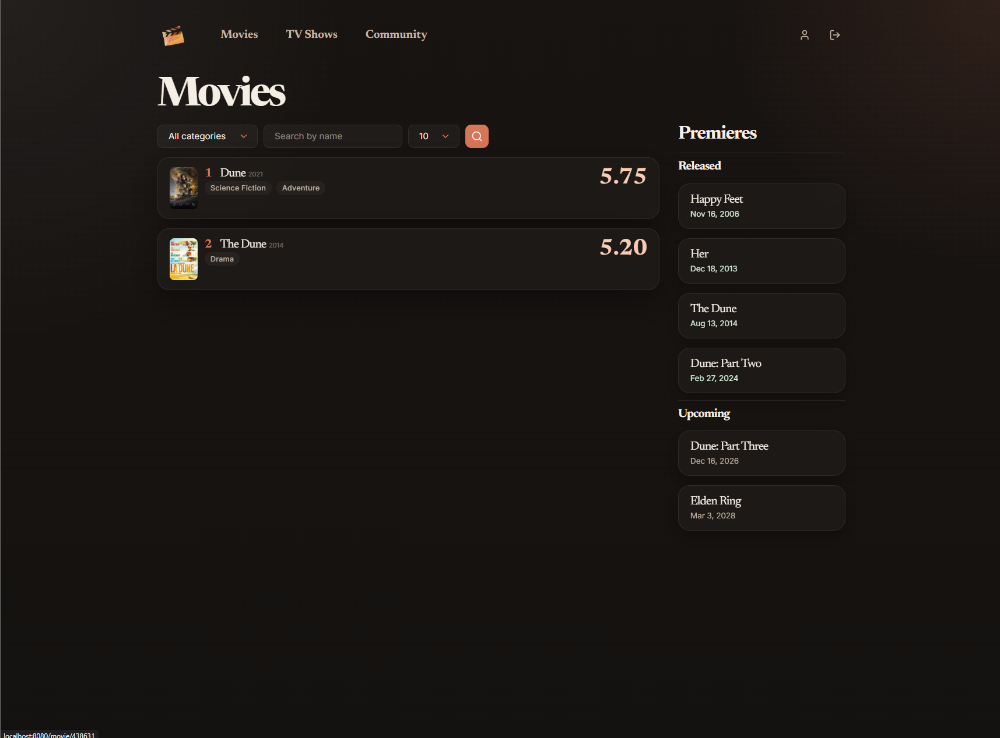

<p align="center">
  
</p>

<p align="center">
  <!-- REPLACE: Update badges with your actual repository URLs -->
  <a href="https://github.com/golmenero/ratelog">
  
  </a>
  <a href="https://github.com/golmenero/ratelog/releases">
  
  </a>
  <a href="https://github.com/golmenero/ratelog/actions/workflows/ci.yml">
  
  </a>
  <a href="https://www.buymeacoffee.com/golmenero">
  
  </a>
</p>

---

Ratelog is a web application that lets you search for movies and TV shows on TMDB, rate them across multiple categories, and generate ranked top lists. It supports multi-user accounts with authentication, a dark-themed responsive UI, and follows/tracking for upcoming releases.

No premium tiers, no hidden features — just a straightforward tool to track and rank what you watch.

<strong>Want to get started?</strong><br/>
Check out the <a href="#run-locally">installation guide</a> or jump straight to <a href="#docker">Docker deployment</a>.<br/>

<strong>Something not working right?</strong><br/>
Open an <a href="https://github.com/golmenero/ratelog/issues">Issue</a> on GitHub.<br/>

<strong>Want to contribute?</strong><br/>
Check out the contributing guide (coming soon).<br/>

<strong>New idea or improvement?</strong><br/>
Open a <a href="https://github.com/golmenero/ratelog/discussions">Discussion</a> on GitHub.<br/>
---

## Features

- **Search** — Find movies and TV shows via TMDB's API
- **Follow** — Track upcoming releases and see them on the premieres page (grouped by Released / Upcoming / No Date)
- **Rate by category** — Score each title from 1 to 10 (0.25 steps) across 5 categories:
  - Directing
  - Cinematography
  - Acting
  - Soundtrack
  - Screenplay
- **Average score** — Automatic mean calculation across all 5 categories
- **Top lists** — Separate pages for movies and TV shows, filterable by year and category with configurable limits
- **Multi-user** — Each user has their own ratings, follows, and tops
- **One rating per title** — Delete and re-rate if you change your mind

<p align="center">
  
  <br>
  
  <br>
  
  <br>
  
</p>

---

## Tech Stack

| Layer | Technology |
|---|---|
| **Backend** | Kotlin 2.4.0 + Spring Boot 3.5.14 |
| **Database** | PostgreSQL 17 (Flyway migrations) |
| **Frontend** | Thymeleaf server-rendered HTML + CSS (dark theme, responsive) |
| **Auth** | Spring Security (BCrypt, form login) |

---

## Docker

### Build Image

```powershell
docker build -t ratelog .
```

### Run with Docker Compose

Container services:

| Service | Description |
|---|---|
| **postgres** | PostgreSQL 17 (port 5432, volume `pgdata`) |
| **ratelog** | App (port 8080, depends on healthy postgres) |

---

## Environment Variables

| Variable | Required | Default | Description |
|---|---|---|---|
| `TMDB_API_KEY` | Yes | — | TMDB API key |
| `REMEMBER_ME_KEY` | Yes | — | Secret key for remember-me cookie |
| `PORT` | No | `8080` | HTTP port |
| `POSTGRES_HOST` | No | `localhost` | PostgreSQL host |
| `POSTGRES_PORT` | No | `5432` | PostgreSQL port |
| `POSTGRES_DB` | No | `ratelog` | Database name |
| `POSTGRES_USER` | No | `ratelog` | Database user |
| `POSTGRES_PASSWORD` | No | `ratelog` | Database password |

---

## Deploy to TrueNAS SCALE

Minimal flow:

1. Copy `.env.example` to `.env` in your Truenas Custom App stack
2. Set `TMDB_API_KEY`, `REMEMBER_ME_KEY` and `POSTGRES_DATA_DIR` (path `/mnt/<pool>/...`)
3. Set `RATLOG_IMAGE=ghcr.io/<owner>/ratelog:latest` (or specific version)
4. Deploy with compose
5. Verify at `http://IP_TRUENAS:8080/api/health`

---

<p align="center">
This project is powered by:
<br/>
<br/>
<a href="https://www.themoviedb.org/documentation/api">

</a>
&nbsp;&nbsp;&nbsp;
<a href="https://spring.io/projects/spring-boot">

</a>
&nbsp;&nbsp;&nbsp
<a href="https://www.postgresql.org/">

</a>
</p>
