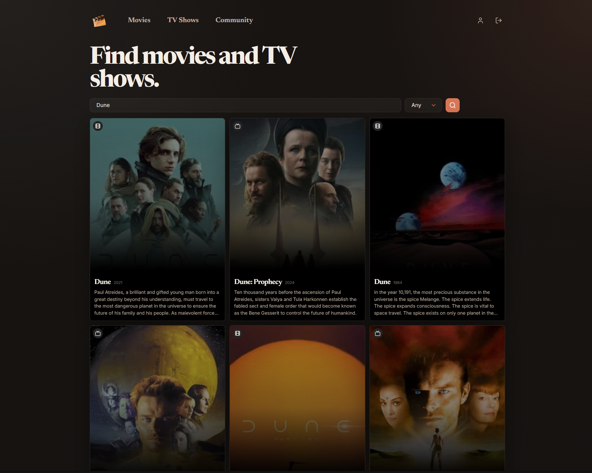
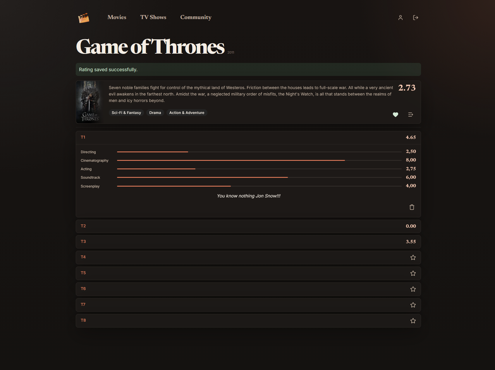
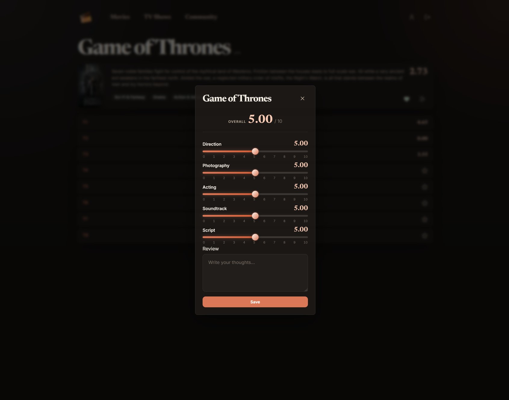
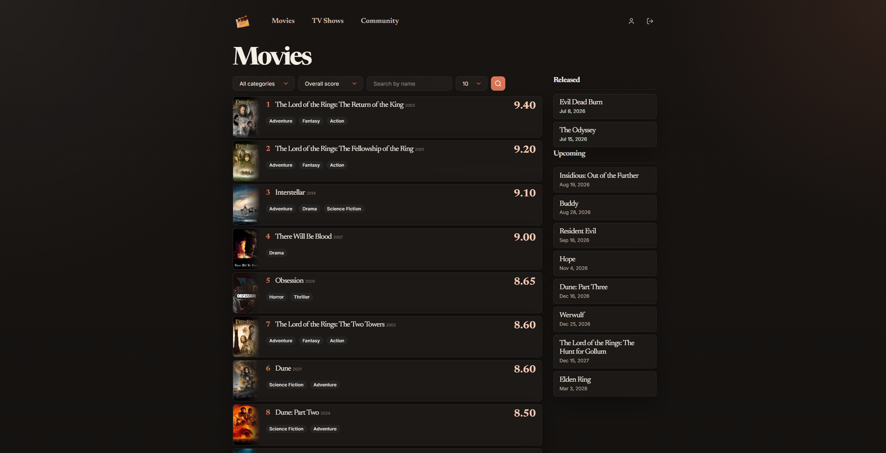

<p align="center">
  
</p>

<p align="center">
  <!-- REPLACE: Update badges with your actual repository URLs -->
  <a href="https://github.com/golmenero/ratelog">
  
  </a>
  <a href="https://github.com/golmenero/ratelog/releases">
  
  </a>
  <a href="https://github.com/golmenero/ratelog/actions/workflows/ci.yml">
  
  </a>
  <a href="https://www.buymeacoffee.com/golmenero">
  
  </a>
</p>

---

Ratelog is a web application that lets you search for movies and TV shows on TMDB, rate them across multiple categories, and generate ranked top lists. It supports multi-user accounts with authentication, a dark-themed responsive UI, and follows/tracking for upcoming releases.

No premium tiers, no hidden features — just a straightforward tool to track and rank what you watch.

<strong>Want to get started?</strong><br/>
Check out the <a href="#installation-guide">installation guide</a>.<br/>

<strong>Something not working right?</strong><br/>
Open an <a href="https://github.com/golmenero/ratelog/issues">Issue</a> on GitHub.<br/>

<strong>Want to contribute?</strong><br/>
Check out the contributing guide (coming soon).<br/>

<strong>New idea or improvement?</strong><br/>
Open a <a href="https://github.com/golmenero/ratelog/discussions">Discussion</a> on GitHub.<br/>
---

## Features

### Discovery & Tracking
- **Search** — Find movies and TV shows via TMDB's API
- **Follow** — Track upcoming releases and see them on the premieres page (grouped by Released / Upcoming / No Date)

### Rating System
- **Rate by category** — Score each title from 1 to 10 (0.25 steps) across 5 categories: Directing, Cinematography, Acting, Soundtrack, and Screenplay
- **Average score** — Automatic mean calculation across all 5 categories
- **One rating per title** — Delete and re-rate if you change your mind

### Lists & Organization
- **Top lists** — Separate pages for movies and TV shows, filterable by year and category with configurable limits
- **Custom lists** — Create and manage personalized lists of movies and TV shows

### Social & Import
- **Community** — Explore other users' ratings, lists, and activity
- **Import from Letterboxd** — Bulk import your ratings and watchlist from a Letterboxd export

### Multi-user & Languages
- **Multi-user** — Each user has their own ratings, follows, and tops
- **Multi language support** — 
  
  
  
  
  
  
  
  
  


<p align="center">
  
  <br>
  
  <br>
  
  <br>
  
</p>

---

## Tech Stack

| Layer | Technology |
|---|---|
| **Backend** | Kotlin 2.4.0 + Spring Boot 3.5.14 |
| **Database** | PostgreSQL 17 (Flyway migrations) |
| **Frontend** | Thymeleaf server-rendered HTML + CSS (dark theme, responsive) |
| **Auth** | Spring Security (BCrypt, form login) |

---

## Installation Guide

### Prerequisites

- Docker & Docker Compose
- TMDB API key ([get one here](https://www.themoviedb.org/settings/api))

### Quick Start

#### Step 1: Clone the repository
```bash
git clone https://github.com/golmenero/ratelog.git
cd ratelog
```

#### Step 2: Copy the environment file
```bash
cp .env.example .env
```

#### Step 3: Configure environment variables

Edit `.env` and configure the variables:

| Variable | Required | Default | Description |
|---|---|---|---|
| `TMDB_API_KEY` | Yes | — | TMDB API key ([get one here](https://www.themoviedb.org/settings/api)) |
| `REMEMBER_ME_KEY` | No | — | Secret key for remember-me cookie |
| `PORT` | No | `8080` | HTTP port |
| `POSTGRES_HOST` | No | `localhost` | PostgreSQL host |
| `POSTGRES_PORT` | No | `5432` | PostgreSQL port |
| `POSTGRES_DB` | No | `ratelog` | Database name |
| `POSTGRES_USER` | No | `ratelog` | Database user |
| `POSTGRES_PASSWORD` | No | `ratelog` | Database password |

> **Warning:** For production deployments, consider setting a strong `REMEMBER_ME_KEY` and `POSTGRES_PASSWORD` to a secure value

#### Step 4: Start the application
```bash
docker compose up -d
```

This will start the following services:
- **postgres**: PostgreSQL 18 (port 5432, volume `pgdata`)
- **ratelog**: App (port 8080, depends on healthy postgres)

#### Step 5: Verify the deployment
```bash
curl http://localhost:8080/api/health
```

---

<p align="center">
This project is powered by:
<br/>
<br/>
<a href="https://www.themoviedb.org/documentation/api">

</a>
&nbsp;&nbsp;&nbsp;
<a href="https://spring.io/projects/spring-boot">

</a>
&nbsp;&nbsp;&nbsp
<a href="https://www.postgresql.org/">

</a>
</p>
